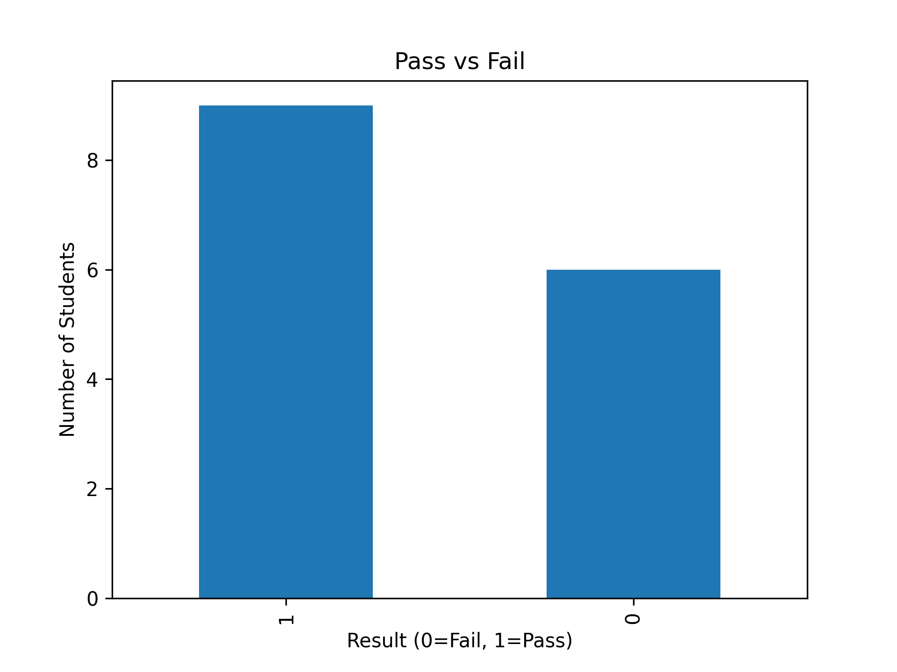

# Python Assignment Part 4

## Description
This project performs data analysis and visualization using Python.

## Features
- Reads student dataset from CSV
- Performs statistical analysis
- Identifies top student
- Generates visualizations:
  - Pass vs Fail chart
  - Subject average chart
  - Study hours vs performance

## Files
- part4_visualization_ml.py
- students.csv

## How to Run
pip install pandas matplotlib
python part4_visualization_ml.py
## Sample Output

## Output
- Displays dataset summary
- Shows graphs for analysis
- ## Sample Output

